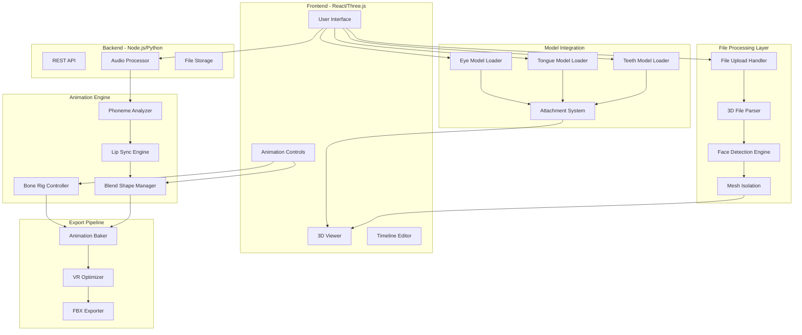
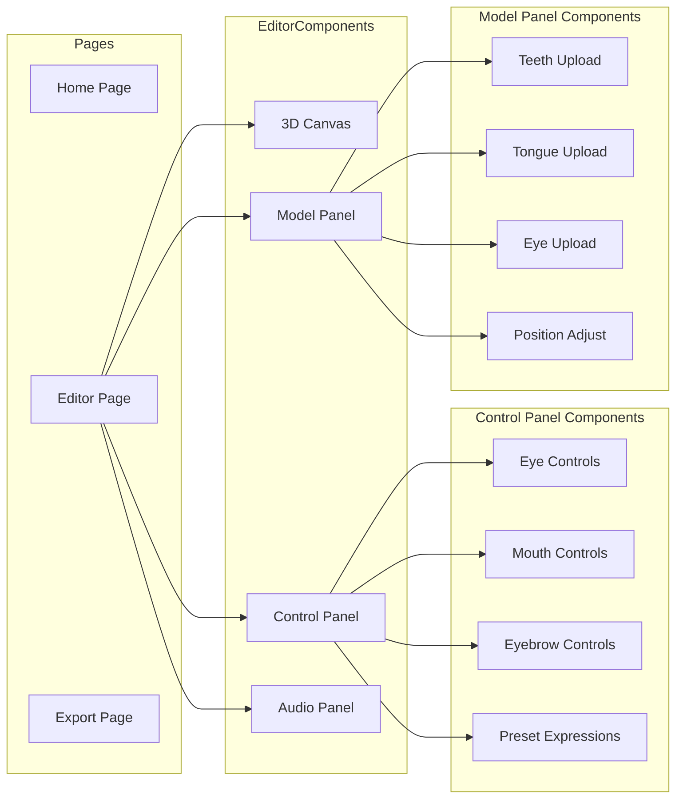
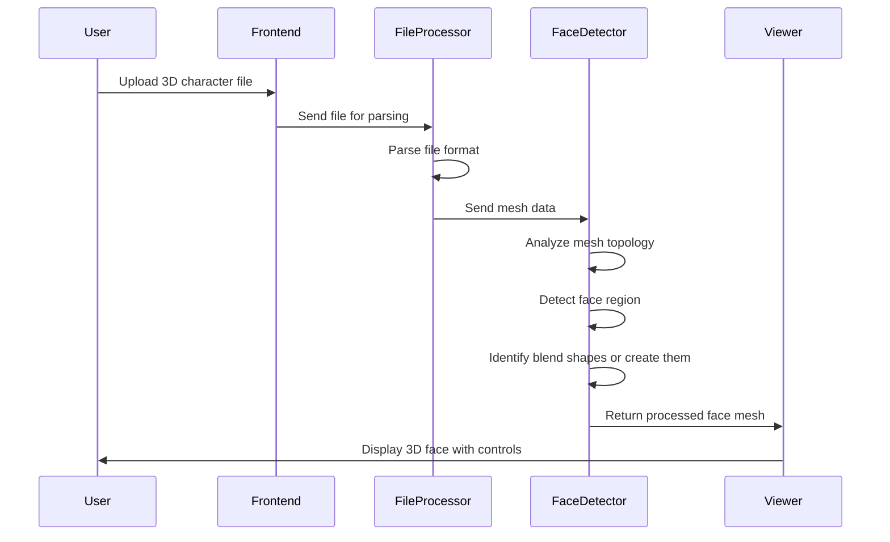
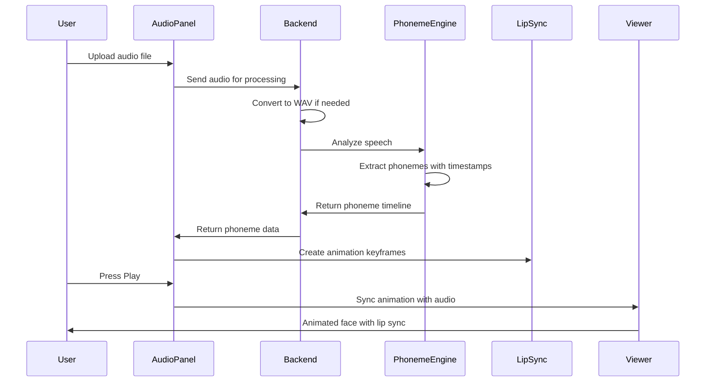
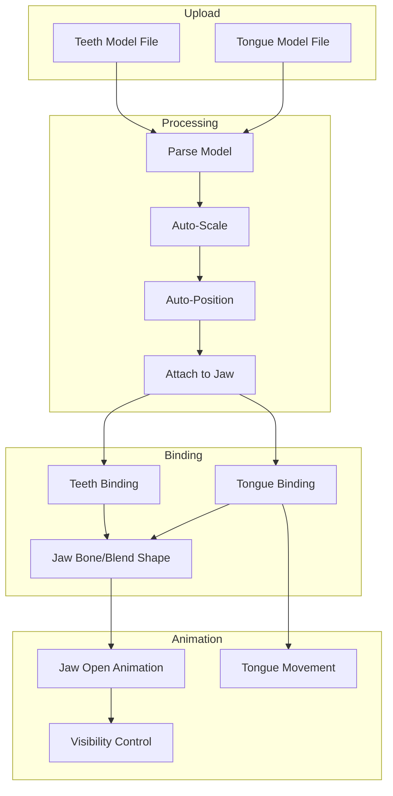
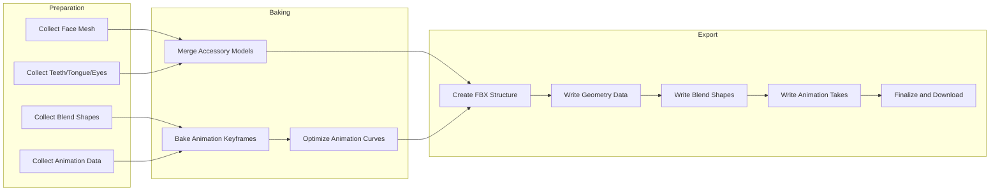

# 3D Face Animator - Technical Architecture Plan

## Project Overview

A web-based 3D character face animation system that allows users to upload 3D character files, automatically detect and isolate the face, and animate facial features with manual controls and audio-driven lip sync. The system supports integration of separate teeth/tongue models and exports VR-ready animated FBX files for Unity/Unreal.

---

## Requirements Summary

| Requirement | Description |
|-------------|-------------|
| Platform | Web-based application |
| Interface | Simple, clean - focus on functionality |
| File Upload | Support for 3D character files |
| Face Detection | Automatic face mesh detection and isolation |
| Manual Controls | Sliders for eyes, mouth, eyebrows |
| Teeth/Tongue | Separate uploadable models integrated into face |
| Audio Lip Sync | Phoneme-based animation from audio files |
| VR-Ready | Optimized for VR applications |
| Export | FBX format for Unity/Unreal |

---

## System Architecture



---

## Technology Stack

### Frontend
| Technology | Purpose |
|------------|---------|
| React 18 | UI framework |
| Three.js | 3D rendering engine |
| React Three Fiber | React renderer for Three.js |
| Drei | Helper components for R3F |
| Zustand | State management |
| TailwindCSS | Styling |

### Backend
| Technology | Purpose |
|------------|---------|
| Node.js/Express | API server |
| Python/FastAPI | Audio processing microservice |
| FFmpeg | Audio conversion |
| Vosk/Whisper | Speech-to-phoneme conversion |

### 3D Processing
| Technology | Purpose |
|------------|---------|
| three-mesh-bvh | Mesh processing and raycasting |
| FBXLoader | FBX file import |
| GLTFLoader | GLTF/GLB file import |
| OBJLoader | OBJ file import |
| FBX SDK (WASM) | FBX export |

### Audio Processing
| Technology | Purpose |
|------------|---------|
| Web Audio API | Audio playback and analysis |
| Rhubarb Lip Sync | Phoneme detection |
| Mozilla DeepSpeech | Speech recognition |

---

## Component Architecture



---

## Data Flow Architecture

### 1. File Upload and Processing Flow



### 2. Audio Lip Sync Flow



---

## Face Detection and Isolation System

### Detection Strategy

The system uses multiple strategies to detect and isolate the face:

1. **Blend Shape Detection**
   - Scan for existing morph targets/blend shapes
   - Map detected shapes to standard facial controls
   - Common naming patterns: `mouthOpen`, `eyeLeft`, `browUp`, etc.

2. **Topology Analysis**
   - Analyze mesh vertex positions
   - Identify face region by vertex density
   - Use heuristics based on typical face proportions

3. **Skeleton-Based Detection**
   - If armature exists, find head bone
   - Isolate vertices weighted to head/face bones
   - Extract face mesh subset

### Blend Shape Mapping

| Control | Blend Shapes Required |
|---------|----------------------|
| Eye Blink Left | eyeBlinkLeft |
| Eye Blink Right | eyeBlinkRight |
| Eye Look Up | eyeLookUpLeft, eyeLookUpRight |
| Eye Look Down | eyeLookDownLeft, eyeLookDownRight |
| Eye Look Left | eyeLookInLeft, eyeLookOutRight |
| Eye Look Right | eyeLookOutLeft, eyeLookInRight |
| Jaw Open | jawOpen |
| Mouth Smile Left | mouthSmileLeft |
| Mouth Smile Right | mouthSmileRight |
| Mouth Frown Left | mouthFrownLeft |
| Mouth Frown Right | mouthFrownRight |
| Mouth Pucker | mouthPucker |
| Lips Together | mouthClose |
| Brow Up Left | browInnerUp, browOuterUpLeft |
| Brow Up Right | browInnerUp, browOuterUpRight |
| Brow Down Left | browDownLeft |
| Brow Down Right | browDownRight |

### Auto-Generation of Blend Shapes

If the uploaded model lacks blend shapes, the system will:

1. Attempt to generate basic blend shapes using mesh deformation
2. Use a pre-trained neural network for blend shape prediction
3. Allow manual vertex manipulation as fallback

---

## Teeth and Tongue Integration System

### Integration Architecture



### Attachment Points

| Model | Parent | Transform Behavior |
|-------|--------|-------------------|
| Upper Teeth | Head bone or upper jaw | Static relative to head |
| Lower Teeth | Jaw bone or jawOpen blend | Moves with jaw opening |
| Tongue | Jaw bone | Moves with jaw, additional controls |
| Eyes | Eye bones or head | Look direction controls |

### Visibility System

- Teeth visible only when jaw opens beyond threshold
- Smooth fade-in as mouth opens
- Proper depth sorting for rendering inside mouth

---

## Audio Lip Sync System

### Phoneme Categories

| Phoneme Group | Visual Shape | Blend Shape Target |
|---------------|--------------|-------------------|
| A, I | Open mouth | jawOpen + mouthOpen |
| E | Wide mouth | mouthSmile |
| O | Round mouth | mouthPucker + jawOpen |
| U | Small round | mouthPucker |
| M, B, P | Closed lips | mouthClose |
| F, V | Lower lip in | mouthFunnel |
| L, TH | Tongue tip visible | tongueOut |
| Rest | Neutral | All at 0 |

### Lip Sync Pipeline

1. **Audio Upload**
   - Accept MP3, WAV, OGG formats
   - Convert to WAV for processing

2. **Phoneme Extraction**
   - Use Rhubarb Lip Sync or similar
   - Generate phoneme timeline with timestamps

3. **Keyframe Generation**
   - Map phonemes to blend shape values
   - Apply smoothing between transitions
   - Generate animation curve

4. **Playback Synchronization**
   - Sync audio playback with animation
   - Real-time blend shape interpolation

---

## Export Pipeline

### FBX Export Process



### Export Options

| Option | Description |
|--------|-------------|
| Include Animation | Export with recorded animation |
| Include Blend Shapes | Export all facial blend shapes |
| Include Accessory Models | Merge teeth/tongue/eyes into export |
| VR Optimization | Reduce poly count, optimize textures |
| Unity Compatible | Use Unity-compatible FBX settings |
| Unreal Compatible | Use Unreal-compatible FBX settings |

---

## User Interface Design

### Main Editor Layout

```
+------------------------------------------------------------------+
|  Logo                                    [Import] [Export] [Help] |
+------------------------------------------------------------------+
|                                          |                        |
|                                          |   Control Panel        |
|                                          |   +------------------+ |
|                                          |   | Eyes             | |
|                                          |   | [====o====] Blink| |
|        3D Viewport                       |   | [====o====] Look | |
|                                          |   +------------------+ |
|        +------------------+              |   | Mouth            | |
|        |                  |              |   | [====o====] Open | |
|        |   Face Model     |              |   | [====o====] Smile| |
|        |                  |              |   +------------------+ |
|        +------------------+              |   | Eyebrows         | |
|                                          |   | [====o====] Up   | |
|                                          |   | [====o====] Down | |
|                                          |   +------------------+ |
|                                          |                        |
+------------------------------------------------------------------+
|  Audio Timeline                                                   |
|  [Play] [Stop] |=====[phoneme bars]=====| 00:00 / 02:30          |
+------------------------------------------------------------------+
|  Model Integration: [+ Teeth] [+ Tongue] [+ Eyes]                 |
+------------------------------------------------------------------+
```

### Control Panel Sections

1. **Eyes Section**
   - Blink Left/Right sliders
   - Look direction (4-way control)
   - Pupil dilation (if supported)

2. **Mouth Section**
   - Jaw open slider
   - Smile/frown slider
   - Pucker slider
   - Lip sync toggle

3. **Eyebrows Section**
   - Left/right raise sliders
   - Inner/outer control
   - Furrow control

4. **Preset Expressions**
   - Happy, Sad, Angry, Surprised
   - Neutral reset button

---

## Project Structure

```
VR/FaceAnimator/
├── frontend/
│   ├── public/
│   │   └── index.html
│   ├── src/
│   │   ├── components/
│   │   │   ├── Canvas3D/
│   │   │   │   ├── FaceViewer.tsx
│   │   │   │   ├── ModelLoader.tsx
│   │   │   │   └── Lighting.tsx
│   │   │   ├── Controls/
│   │   │   │   ├── ControlPanel.tsx
│   │   │   │   ├── EyeControls.tsx
│   │   │   │   ├── MouthControls.tsx
│   │   │   │   ├── BrowControls.tsx
│   │   │   │   └── PresetButtons.tsx
│   │   │   ├── ModelIntegration/
│   │   │   │   ├── TeethUploader.tsx
│   │   │   │   ├── TongueUploader.tsx
│   │   │   │   ├── EyeUploader.tsx
│   │   │   │   └── AttachmentManager.tsx
│   │   │   ├── Audio/
│   │   │   │   ├── AudioUploader.tsx
│   │   │   │   ├── Timeline.tsx
│   │   │   │   └── LipSyncController.tsx
│   │   │   └── Export/
│   │   │       ├── ExportDialog.tsx
│   │   │       └── ExportOptions.tsx
│   │   ├── hooks/
│   │   │   ├── useModelLoader.ts
│   │   │   ├── useFaceDetection.ts
│   │   │   ├── useBlendShapes.ts
│   │   │   ├── useLipSync.ts
│   │   │   └── useExport.ts
│   │   ├── stores/
│   │   │   ├── modelStore.ts
│   │   │   ├── animationStore.ts
│   │   │   └── audioStore.ts
│   │   ├── utils/
│   │   │   ├── faceDetector.ts
│   │   │   ├── blendShapeMapper.ts
│   │   │   ├── phonemeMapper.ts
│   │   │   └── fbxExporter.ts
│   │   ├── types/
│   │   │   └── index.ts
│   │   ├── App.tsx
│   │   └── main.tsx
│   ├── package.json
│   └── vite.config.ts
│
├── backend/
│   ├── src/
│   │   ├── routes/
│   │   │   ├── upload.ts
│   │   │   ├── audio.ts
│   │   │   └── export.ts
│   │   ├── services/
│   │   │   ├── fileProcessor.ts
│   │   │   ├── phonemeExtractor.ts
│   │   │   └── fbxExporter.ts
│   │   ├── utils/
│   │   │   └── audioConverter.ts
│   │   └── index.ts
│   ├── package.json
│   └── tsconfig.json
│
├── audio-service/
│   ├── phoneme_extractor.py
│   ├── requirements.txt
│   └── Dockerfile
│
├── shared/
│   └── types/
│       └── index.ts
│
├── docker-compose.yml
└── README.md
```

---

## Implementation Phases

### Phase 1: Core Foundation
- Project setup with React, Three.js, and backend
- Basic 3D viewer with model loading
- File upload for FBX, GLTF, OBJ formats
- Basic face mesh display

### Phase 2: Face Detection and Controls
- Face mesh detection algorithm
- Blend shape detection and mapping
- Manual slider controls for basic expressions
- Eye, mouth, and eyebrow controls

### Phase 3: Teeth/Tongue Integration
- Secondary model upload system
- Auto-positioning and scaling
- Attachment to jaw animation
- Visibility control based on mouth opening

### Phase 4: Audio Lip Sync
- Audio file upload and processing
- Phoneme extraction service
- Phoneme-to-blend shape mapping
- Timeline visualization and playback

### Phase 5: Export and Polish
- FBX export with animations
- VR optimization options
- Unity/Unreal compatibility settings
- UI polish and performance optimization

---

## Technical Considerations

### Performance Optimization
- Use instanced rendering for complex scenes
- Implement LOD (Level of Detail) for VR
- Lazy load audio processing
- Web Worker for heavy computations

### Browser Compatibility
- WebGL 2.0 required
- Web Audio API support
- File System Access API for exports
- Fallback for older browsers

### File Size Limits
- Maximum 100MB for 3D models
- Maximum 50MB for audio files
- Chunk upload for large files

### Security
- Validate file types on upload
- Sanitize file names
- Scan for malicious content
- CORS configuration

---

## API Endpoints

### File Management
| Method | Endpoint | Description |
|--------|----------|-------------|
| POST | /api/upload/model | Upload 3D character file |
| POST | /api/upload/accessory | Upload teeth/tongue/eye model |
| POST | /api/upload/audio | Upload audio file |
| GET | /api/files/:id | Retrieve uploaded file |
| DELETE | /api/files/:id | Delete uploaded file |

### Processing
| Method | Endpoint | Description |
|--------|----------|-------------|
| POST | /api/process/detect-face | Detect face in uploaded model |
| POST | /api/process/phonemes | Extract phonemes from audio |
| GET | /api/process/status/:id | Check processing status |

### Export
| Method | Endpoint | Description |
|--------|----------|-------------|
| POST | /api/export/fbx | Generate FBX export |
| GET | /api/export/download/:id | Download exported file |

---

## Risk Assessment

| Risk | Impact | Mitigation |
|------|--------|------------|
| Face detection fails on unusual models | High | Provide manual face region selection fallback |
| Blend shapes not present in model | High | Auto-generate basic blend shapes or manual vertex editing |
| Audio processing too slow | Medium | Use Web Workers, show progress, allow cancellation |
| FBX export browser limitations | Medium | Server-side export fallback |
| Large file upload issues | Medium | Chunk uploads, compression |
| VR performance issues | Medium | LOD system, optimization presets |

---

## Success Criteria

1. Users can upload any common 3D format and see the face isolated
2. Manual sliders provide smooth real-time face animation
3. Teeth and tongue are visible and animate with jaw movement
4. Audio lip sync produces natural-looking results
5. Exported FBX works correctly in Unity and Unreal
6. System performs smoothly in browser with 60fps

---

## Next Steps

1. Set up project structure and development environment
2. Implement basic 3D viewer with model loading
3. Build face detection system
4. Create control panel with sliders
5. Implement teeth/tongue integration
6. Build audio lip sync pipeline
7. Create FBX export functionality
8. Test and optimize for VR
